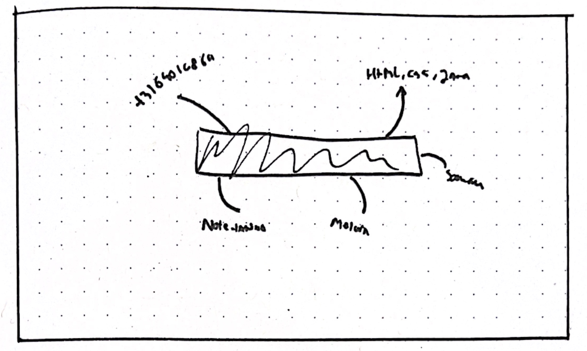
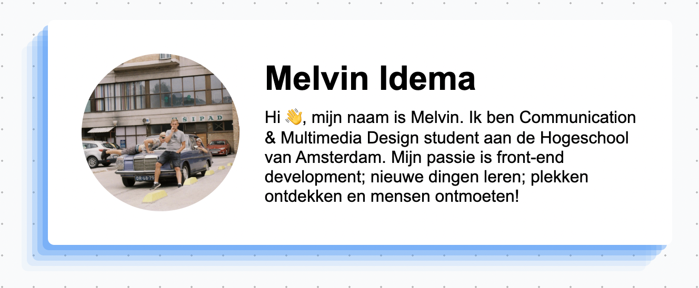
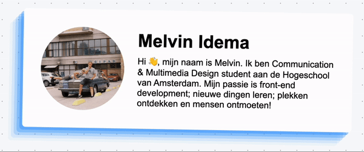
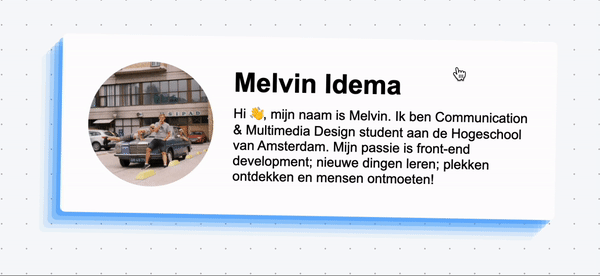

# Visitekaartje opdracht
#minor #HvA #WAfS

> [!note] Link
> https://kaartje.ikbenmel.vin/

## Opdracht
Als kick-off voor de [[minor Web Design & Development]] én het vak [[Web App from Scratch]] hebben we de opdracht gekregen om een digitaal visitekaartje te maken in HTML, CSS & Javascript. In de loop van de week wordt je ingedeeld bij een *squad* waar je een [[squadpagina]] mee gaat maken om de visitekaartjes van je *squad* in te tonen.

> [!example] Voorbeelden
> Visitekaartje van Joost: https://joost.fdnd.nl
> Visitekaartje van Koop: https://koop.fdnd.nl

> [!quote] User Story
> *Als potentieel stagebedrijf, wil ik online een leuke eerste indruk van een student krijgen, zodat ik een inschatting kan maken of ik de student ga uitnodigen voor een sollicitatiegesprek.*

## Hoe maak je een creatief digitaal visitekaartje?
Als eerste in het proces van een creatief digitaal visitekaartje maken is door te gaan schetsen. We kregen de opdracht om 10 schetsen te maken waarvan elke schets niet meer dan 30 seconden mocht duren. Uiteindelijk kwam ik op deze mindmap-like schets uit:



Het idee hierbij is dat mijn naam "*Melvin Idema*" groot in het midden van de pagina komt met mijn informatie, hobbies en dergelijke als een mindmap eromheen. 

## Hoe bereid je dit ontwerp technisch voor?
Om erachter te komen hoe je dit ontwerp technisch uitwerkt heb ik gebruik gemaakt van een [[breakdown schets]] geïnspireerd op die van Koop en het vak front-end voor designers.

undefined

## Het ontwerp daadwerkelijk uitwerken
Het ontwerp daadwerkelijk uitwerken is andere koek en dat blijkt ook tijdens het uitwerken. Ik ben begonnen met een simpele HTML & CSS pagina waarin mijn naam in het midden staat van een pagina met bullet journal achtergrond zoals ook in de schetsen te zien. Daarna heb ik geprobeerd om de mindmap items om de naam heen te krijgen.

Hier blijkt een, voor mij, grote flaw in de breakdown schets te zitten. Hoewel iets tijdens het voorbereiden logisch lijkt. Blijkt in dit geval een andere HTML-structuur makkelijker om met CSS te stijlen. 

Toch lukt het me niet om de mindmap-stijl uit te werken. Dit is waar ik verder ga met de volgende stap: M'n naam ophalen uit de Tribe API.

## Data ophalen uit de Tribe API

### Serverless Functions
Na een klein lesje [[Serverless Functions]] van Robert Spiers heb ik een serverless function geschreven die op basis van een naam - *I.P.V. op basis van een ID* - informatie ophaalt uit de Tribe API. 

**Deze haalt eerst alle members op:**
```js
async function fetchMembers() {  
    try {  
        const res = await fetch(`https://whois.fdnd.nl/api/v1/members?first=200`);  
        const data = await res.json();  
        return data;  
    } catch (err) {  
        return err;  
    }  
}
```

**Om vervolgens een specifieke member eruit te filteren op basis van naam:**
```js
const member = allMembers.members.filter(member => member.name.toLowerCase() === name.toLowerCase());
```

**Dit alles verpakt in een *handler***
```js
async function handler(req, res) {  
	// De naam wordt uit de URL gehaald door middel van de query property
    const { name } = req.query;  
  
    if(!req.query.name) {  
        res.json({  
            status: 500,  
            error: "No name given"  
        })  
    }  
    const allMembers = await fetchMembers();  
    const member = allMembers.members.filter(member => member.name.toLowerCase() === name.toLowerCase());  
  
    res.status(200).json({  
        member  
    })  
}
```

Deze serverless function heb ik vervolgens gedeployed op Vercel en is aan te roepen via m'n eigen domein:

> [!note] API Link
> https://serverless-shit.ikbenmel.vin/api/findMemberByName?name=Melvin

### Client-Side Fetching
Vervolgens fetch ik m'n serverless function op m'n visitekaartje pagina:

```js
async function fetchMemberData(member) {  
    const res = await fetch(`https://serverless-shit.ikbenmel.vin/api/findMemberByName?name=${member}`);  
    const data = await res.json();  
    return data.member[0];  
}
```

### De data blijkt toch anders dan gedacht
Nu blijkt de data van de Tribe API toch anders te zijn dan de data waarvan ik uit ben gegaan in m'n voorbereiding. Ik wil graag zoveel mogelijk gebruik maken van de data uit de API én is het mindmap idee toch erg lastig. 

Dus heb ik ervoor gekozen om het ontwerp te versimpelen en over te gaan op creatie i.p.v. ideation. 

## Het uitwerken van de front-end
In plaats van een mindmap heb ik besloten om m'n profielfoto, naam en bio te laten zien op een kaartje. Via één van m'n favoriete websites https://getcssscan.com/css-box-shadow-examples heb ik een mooie box shadow gevonden en via https://coolers.co een mooie blauwe kleur. 


### Responsiveness
Nu blijkt ie alleen nog niet responsive te zijn op mobiel. Te breed namelijk. Dit is makkelijk op te lossen door de content onder elkaar te plaatsen.
undefined
undefined

### Breathing animatie
Dit statische vind ik alleen een beetje saai. Geïnspireerd door de voorbeelden van visitekaartjes heb ik een simpele breathing animatie toegevoegd.


### Flipping
Alleen de breathing animatie vind ik nog steeds erg saai. Ik zit erg te twijfelen om misschien wat meer informatie te tonen bij een bepaalde interactie. Voor nu heb ik voor de grap een flip toegevoegd bij het klikken.


## Te bekijken op
> [!note] Link
> https://kaartje.ikbenmel.vin/